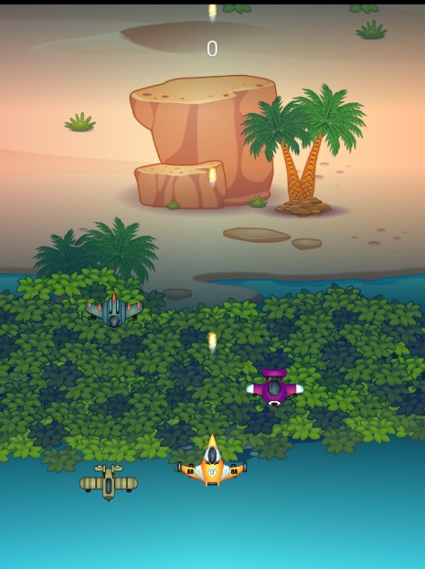
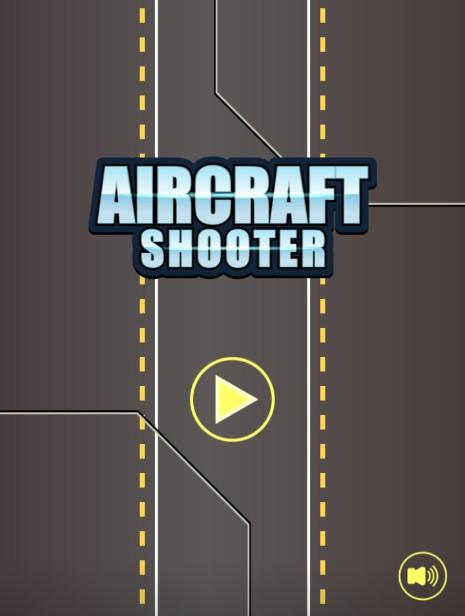
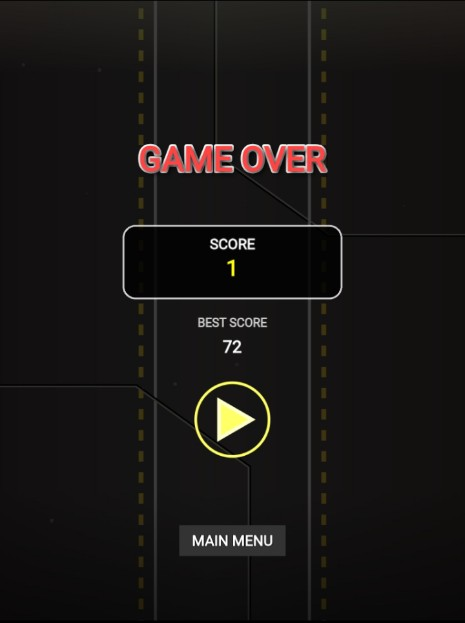
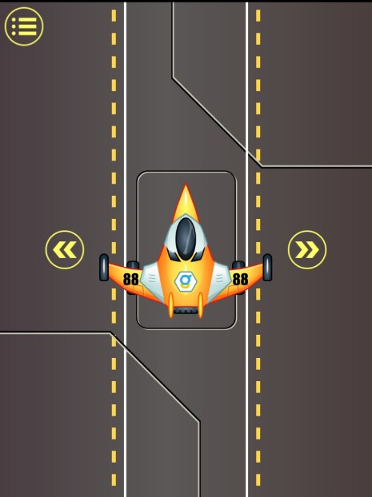

# ✈️ Aircraft Shooter

**Aircraft Shooter** adalah game tembak-tembakan pesawat bergaya arcade yang penuh aksi dan tantangan. Kendalikan pesawat tempurmu, hindari peluru musuh, dan kalahkan musuh sebanyak mungkin untuk mendapatkan skor tertinggi!

🎮 **[➡️ Mainkan Sekarang](https://sammdodev.github.io/Sky-Warzone/)**



## 🎮 Fitur Utama

- 🚀 **Kontrol yang Responsif**: Gerakkan pesawat ke kiri dan kanan untuk menghindar dan menembak.
- 🎯 **Gameplay Seru & Adiktif**: Cocok dimainkan saat santai maupun untuk mengejar skor tertinggi.
- 🌴 **Latar Belakang Tropis & Jalanan Futuristik**: Desain visual penuh warna dan memanjakan mata.
- 🔊 **Efek Suara Dinamis**: Memberikan nuansa arcade yang klasik.

## 📷 Screenshot

| Menu Utama | Gameplay | Game Over | Pilih Pesawat |
|------------|----------|------------|----------------|
|  |  |  |  |

> **Best Score**: Bisa kamu kalahkan?

## 🕹️ Cara Bermain

1. Tap tombol ▶️ untuk memulai permainan.
2. Gunakan tombol arah kiri/kanan untuk menggerakkan pesawat.
3. Otomatis menembak ke depan — fokuslah menghindar dan mengalahkan musuh.
4. Game berakhir jika pesawat kamu tertabrak peluru atau musuh.

## 🧠 Teknologi

Game ini dibuat dengan:

- **Phaser.js** – Framework powerful untuk game HTML5.
- **JavaScript & HTML/CSS** – Untuk pengelolaan antarmuka.
- **LocalStorage** – Menyimpan skor tertinggi secara lokal.

## 📦 Instalasi Lokal (Opsional)

Jika ingin menjalankan secara lokal:

```bash
git clone https://github.com/sammdodev/Sky-Warzone.git
cd Sky-Warzone
start index.html
